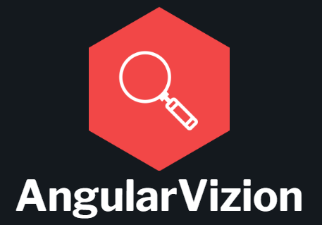

AngularVizion is an image recognition web application developed with Angular, PyTorch and Flask.
The aim of this simple project is to practice using several popular tech tools simultaneously. 
The application allows users to upload images and uses Facebook's [DETR-RESNET-50](https://huggingface.co/facebook/detr-resnet-50) model to recognize objects in these images.

## Features

- User interface developed with Angular.
- Image pre-processing using PyTorch for input data preparation.
- Object recognition from a set of 91 classes on loaded images.
- Object recognition results displayed on the user interface.

### 🏡 Setup for local deployment

 
1. Install [Node.js](https://nodejs.org/en) and [Python env] (https://www.python.org/downloads/).

2. Clone git repository :
`git clone https://github.com/Yoannmont/AngularVizion.git`

3. Start **Client app** :
In terminal : 
 - Ensure you're in client folder ( or run `cd client`).
 - Run `npm install` to install dependencies.
 - Build app by running `ng serve -o` (Default port for client is 4200).

3. Start **Server app**:
In terminal :
- Ensure you're in server folder (or run `cd server`)
- Install libraries by running `pip install -r requirements.txt`
- Build app by running `flask run` (Default port for server is 5000).

### 🐳 Setup for Docker deployment

1. Install [Docker Desktop](https://www.docker.com/products/docker-desktop/) (and create an account).

2. Clone git repository :
`git clone https://github.com/Yoannmont/AngularVizion.git`

3. Build client and server apps in containers by running
`docker compose up` (Client port 4200 and server port 5000 are binded to your host machine ports by default).

## Developed with 

- **Angular CLI 17.3**: Front-end framework for user interface development.
- **Flask**: Python backend for image pre-processing API and model inference.
- **PyTorch**: Machine Learning library used for image processing. 
- **Docker**: Application containerization.
